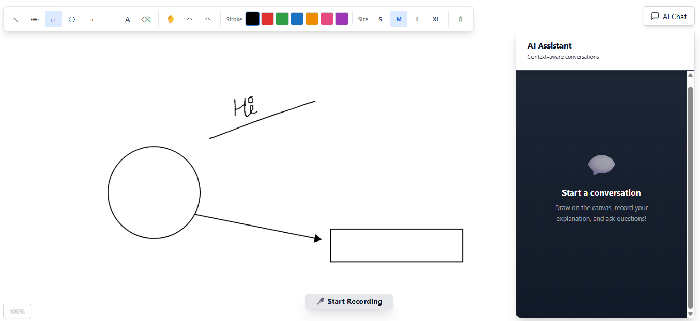

# ExplainCanvas

Draw, speak, and get AI feedback on your system architecture designs in real-time.

## Quick Start

### 1. Setup Backend
```bash
cd backend
pip install -r requirements.txt
```
Create `backend/.env` and add:
```
GEMINI_API_KEY=your_api_key_here
```
```bash
python main.py
```

### 2. Setup Frontend
```bash
cd frontend
npm install
npm start
```

## How to Use

1. Draw on the canvas
2. Click **Start Recording** (captures canvas + voice)
3. Explain your design while drawing
4. Click **Stop & Send** to get AI feedback
5. Continue the conversation with context

## Tech Stack

- **Frontend**: React, HTML5 Canvas
- **Backend**: FastAPI (Python)
- **AI**: Google Gemini 2.0 Flash

## Requirements

- Node.js 18+
- Python 3.10+
- Google Gemini API Key
